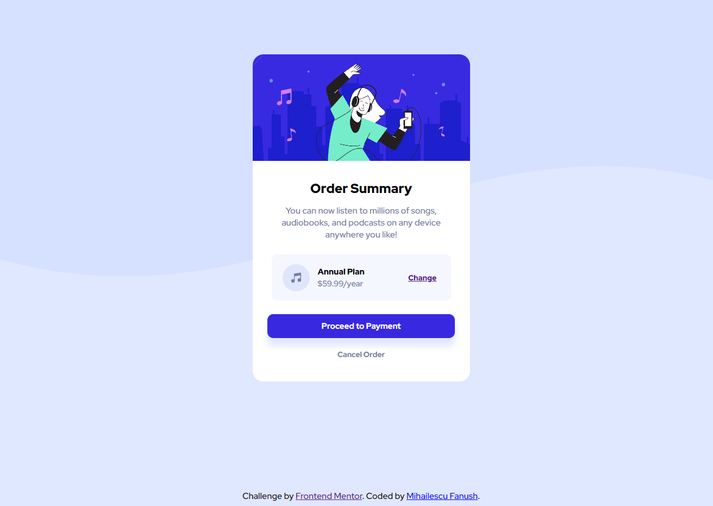
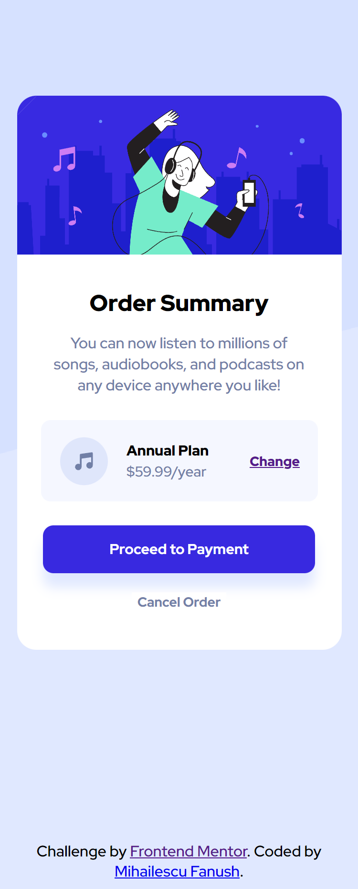

# Frontend Mentor - Order summary card solution

This is a solution to the [Order summary card challenge on Frontend Mentor](https://www.frontendmentor.io/challenges/order-summary-component-QlPmajDUj). Frontend Mentor challenges help you improve your coding skills by building realistic projects. 

## Table of contents

- [Overview](#overview)
  - [The challenge](#the-challenge)
  - [Screenshot](#screenshot)
  - [Links](#links)
  - [Built with](#built-with)
  - [What I learned](#what-i-learned)
  - [Useful resources](#useful-resources)

**Note: Delete this note and update the table of contents based on what sections you keep.**

## Overview

### The challenge

Users should be able to:

- See hover states for interactive elements

### Screenshot

### Links

- Solution URL: [Add solution URL here](https://github.com/Fanushhh/Order-summary-component/)
- Live Site URL: [Add live site URL here](https://fanushhh.github.io/Order-summary-component/)

### Built with

- Semantic HTML5 markup
- CSS custom properties
- Flexbox

### What I learned

I learned a few new tricks about SVG(Scalable Vector Graphics), how to create them, modify them using diferent properties

To see how you can add code snippets, see below:

### Useful resources

- [Example resource 1](https://www.svgbackgrounds.com/how-to-add-svgs-with-css-background-image/) - This helped me understand what properties I can adjust in order to make the SVG look like in the design request.Really recommend it if you feel lost.

## Author

- Website - [Mihailescu Fanush Gabriel](https://github.com/Fanushhh)
- Frontend Mentor - [@Fanushhh](https://www.frontendmentor.io/profile/Fanushhh)
